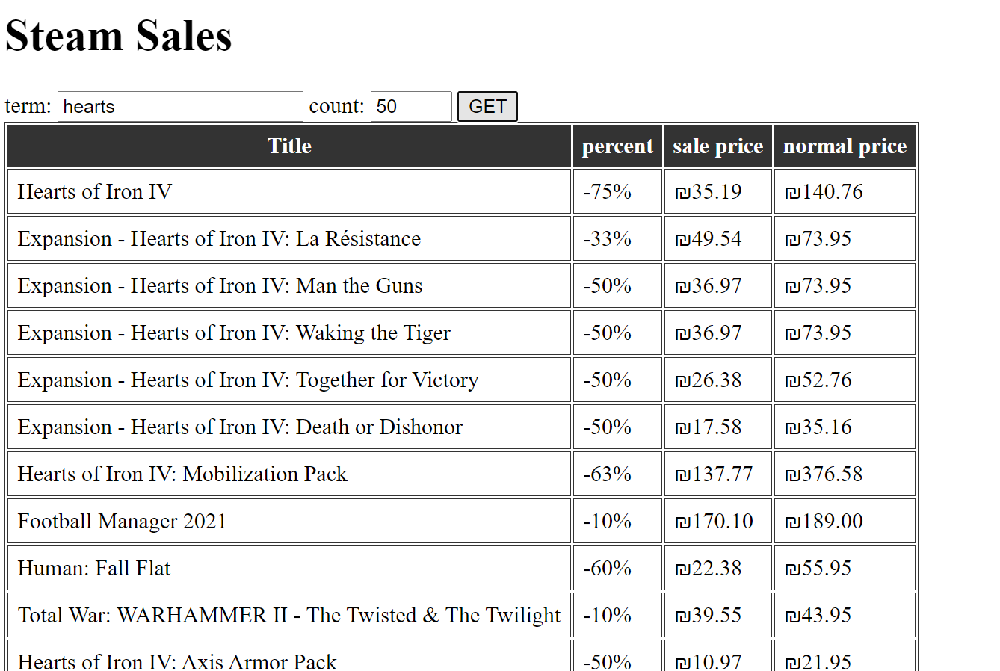
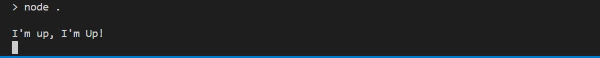
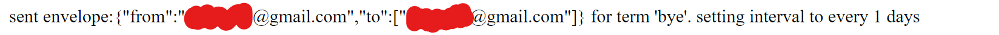

# Steam Sales Scrapper

Uses [puppeteer](https://github.com/puppeteer/puppeteer) to get what's on sale on Steam today.
## Declaration
this application is not affiliated with Steam or Valve in any way.  
it uses publicly available information and wraps it up nicely. use it on your own behalf and risk. 

## Setup
1. clone this repo on your computer and open it  

2. run `npm install` to install all required dependencies
4. to start the app run `npm start` , or `npm run dev` for nodemon hot-reload. It will log a message when it's up.
 the default port is **3001**
5. you are good to go! the app should be on [localhost:3001](localhost:3001/) 
5. ...
5. profit.

## To use with Email
To send and receive the suggestions by mail, you'll have to use a mail account.  
I used [nodemailer](https://www.npmjs.com/package/nodemailer) for that.
1. either create a `.env` file or edit the provided [example.env](example.env) file and change its name to `.env`
    - If you are using gmail, you may have to enable "less secure apps" for your account. look [here](https://support.google.com/accounts/answer/6010255) for instructions.  
    **It is less secure, Do it at your own risk!**
2. to send and email once, send get request like: [localhost:3001/mail?term=hearts&count=50](localhost:3001/mail?term=hearts&count=50)
    - term is the search term
    - count is how many titles in the search to look through (min 25)
3. to set an interval, add `&repeat=number_of_days`. the app should return the message `interval set to number_of_days`
4. you should see something like this:

5. the server shall fire a message as well every time it sends mails. 